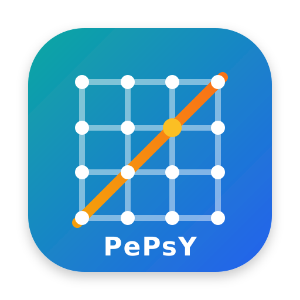

# Pepsy Library



`pepsy` is a Python package for circuit simulation and related DMRG fitting workflows.

Current package version: `0.3.0` (from `pyproject.toml` / `pepsy.__version__`).
See the [changelog](CHANGELOG.md) for release history and versioned changes.

## Package Layout
- `src/pepsy/`: installable library code
  - `backends/`: backend selection, conversion, and linear algebra registration
  - `tensors/`: lattice maps (`OneDMap`), state/MPO/PEPO builders, contraction helpers
  - `operators/`: gates, gate application, MPO/PEPO builders, and Hamiltonian helpers
  - `boundary/`: boundary state initialization (`BdyMPS`), sweeps (`CompBdy`), and metrics
  - `solvers/`: gradient-based and finite-difference solvers
  - `fitting/`: local tensor fitting routines (`FIT`)
  - `optimizers/`: sweep, global, energy, MPS, MPO, and PEPS optimizers
  - `sampling/`: `MpsSampler` and related sampling utilities
  - `_internal/`: private formatting and utility helpers
- `examples/`: lightweight runnable examples kept with the package
- `../pepsy_examples/`: external notebooks and smoke examples, including direct
  fermionic Symmray Fermi-Hubbard starters under `fermi_hubbard/`
- `docs/`: Sphinx documentation source
- `tests/`: package tests

## Install
```bash
pip install -U --no-deps -e .
# Optional backends:
# pip install -e .[torch]
# pip install -e .[solvers]
# jax backend (manual, platform-specific wheels):
# pip install jax jaxlib
# Optional plotting helpers:
# pip install -e .[viz]
```

## Quick Usage
```python
import pepsy
import quimb.tensor as qtn

ket = qtn.PEPS.rand(Lx=3, Ly=3, bond_dim=2, seed=1, dtype="complex128")
ket_tagged, norm = pepsy.build_bra_ket(ket=ket)

bdy = pepsy.BdyMPS(tn_flat=ket_tagged, tn_double=norm, chi=32, single_layer=False)
res = pepsy.contract_boundary(norm=norm, bdy=bdy, direction="y", n_iter=2)

print(pepsy.__version__, res.cost)
```

## Symmetric Fermionic States

Pepsy includes optional Symmray-backed symmetric tensor-network wrappers. For
spinful Fermi-Hubbard work, `model="fermi_hubbard"` uses total particle-number
`U1`, while `model="fermi_hubbard_u1u1"` uses spin-resolved `U1U1` charges
`(N_up, N_down)`.

For direct fermionic Fermi-Hubbard work, the main Pepsy/Symmray methods
reference is Gao et al., "Fermionic tensor network contraction for arbitrary
geometries", Phys. Rev. Research 7, 023193 (2025),
https://doi.org/10.1103/PhysRevResearch.7.023193. It motivates keeping
fermionic parity and leg-order metadata in Symmray arrays while letting quimb
choose graph-level contraction orders.

The current finite-chain Fermi-Hubbard MPO convention and validation record are
tracked in `learning/fermionic_mpo.md` and
`docs/development/fermi_hubbard_u1u1_mpo_notes.md`.

```python
import pepsy as py

psi = py.SymMPS.for_model(
    "fermi_hubbard_u1u1",
    16,
    bond_dim=4,
    site_charge=py.site_charge_from_occupations([(1, 0), (0, 1)] * 8),
)

assert psi.overall_charge() == (8, 8)

ordering = psi.fermionic_ordering()
assert ordering["enabled"]
assert ordering["methods_reference"]["doi"] == "10.1103/PhysRevResearch.7.023193"
```

## Documentation
Build docs locally:

```bash
pip install -e .[docs]
NUMBA_CACHE_DIR=/tmp PYTHONPYCACHEPREFIX=/tmp \
sphinx-build -W -b html docs docs/_build/html
```

Main docs sections:

- `getting_started`
- `tutorials/`
- `howto/`
- `api/`

## Notes
- `.gitattributes` marks notebooks as binary to avoid noisy diffs.
- `.gitignore` excludes checkpoints, caches, `cash/`, and `nohup.out`.
