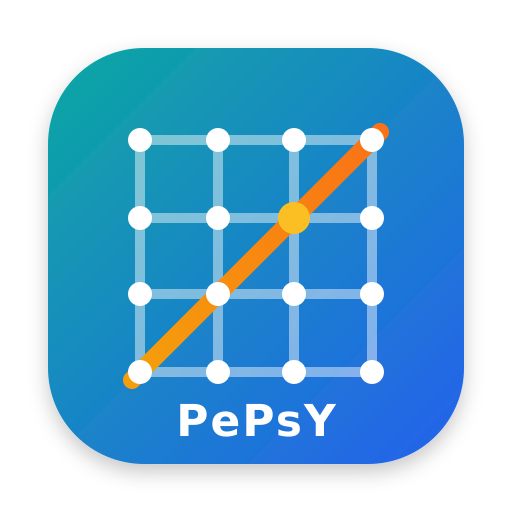

# PePsY



PePsY (“PEPS in Python”) is a tensor-network library for circuit simulation,
contraction, optimization, sampling, and variational Monte Carlo.
The Python package is named `pepsy`.

Pepsy is independent of downstream packages such as Gaugy. Graph planning,
tensor-network construction, contraction, compression and general solvers
live here; downstream packages call these public APIs for their own domain
algorithms. See [package ownership](docs/development/package_layout.md#pepsy-and-downstream-packages).

Cluster PEPO `trace_exp` constructs and traces the selected PEPO, including
rank caps and compression. Use `pepsy.operators.trace_pepo(pepo)` to measure
an existing result; `partition_trace_exp` is the explicit uncompressed scalar
shortcut. See the [trace contract](docs/api/operators/cluster_expansion.md#trace-of-the-constructed-pepo).

Native bosonic cluster MPOs support exact Torch/JAX autodiff and sector-preserving
NumPy/Torch compressed assembly. See the [construction and gradient limits](docs/api/operators/mpo_cluster.md#native-block-sparse-cluster-mpos).

For repeated spin-cluster evaluations, experimental
[`prepare_cluster_channels`](docs/api/operators/cluster_channels.md) assembles
compact MPO/PEPO tensors directly from local factors with frozen QR-prepared
bases, avoiding expanded histories and numerical decomposition during
autodiff. MPO preparation first shares formally equivalent transitions;
further numerical reductions define an explicit approximate operator.
For exact graph MPOs, `preparation="frontier"` also avoids enumerating
complete collections by retaining only clusters crossing the current cut.
For graph/square PEPOs, `preparation="symbolic"` shares exact graph channels
before routing and reuses a linear reference template. Full channels preserve
the chosen expansion; capped accuracy and speed must be measured.

Version **0.5.0** · Python **3.12+** · [Changelog](CHANGELOG.md)

## Install from GitHub

Pepsy is distributed through this GitHub repository. From a checkout, run:

```bash
python -m pip install .
```

Use your existing Python environment, or follow the
[installation guide](docs/installation.md) to create one. Add extras only when
needed, for example `python -m pip install ".[symmetry]"`.

## First contraction

```python
import quimb.tensor as qtn
from pepsy.boundary import BdyMPS, build_bra_ket, contract_boundary

ket = qtn.PEPS.rand(Lx=3, Ly=3, bond_dim=2, seed=1, dtype="complex128")
ket_tagged, norm = build_bra_ket(ket=ket)

bdy = BdyMPS(
    tn_flat=ket_tagged,  # single-layer shape/backend reference
    tn_double=norm,     # double-layer contraction target
    chi=32,
    single_layer=False,
)
res = contract_boundary(norm=norm, bdy=bdy, direction="y", n_iter=2)
print(res.cost)
```

The [getting-started guide](docs/getting_started.md) explains each step and
shows how to collect fidelity diagnostics.

## Find what you need

| Task | Guide |
| --- | --- |
| Choose a workflow | [API starting points](docs/api/start_here.md) |
| Learn through examples | [Tutorials](docs/tutorials/index.md) and [runnable examples](docs/examples.md) |
| Find classes, functions, and imports | [API reference](docs/api/index.md) and [package map](docs/api/package.md) |
| Use symmetric or fermionic states | [Symmetric tensors](docs/api/tensors/symmetric.md) |
| Upgrade from 0.4.1 | [Migration guide](docs/development/api-migration.md) |
| Check compatibility guarantees | [API stability](docs/stability.md) |
| Contribute or run tests | [Contributing](CONTRIBUTING.md) |
| Track cluster PEPO / downstream optimization | [Development status](docs/development/cluster_optimization_status.md) |
| Find implementation notes | [Development documentation](docs/development/README.md) |

Prefer imports from the owning namespace, such as `pepsy.tensors` or
`pepsy.optimizers`. The top-level `pepsy` aliases remain available for
compatibility.

Documentation lives in [docs/](docs/index.md) as linked Markdown pages;
reading it requires no documentation builder or extra packages.
